## Front-End | Introdução a Programação

  
1. JavaScript

  
  ### O que é o JavaScript?
  - É uma linguagem de programação interpretada
  - Permite criar aplicativo mobile, desktop, web, etc.
  - É usado no front-end e no back-end
  
  ### ECMAScript + JavaScript
  - [ECMAScript](https://www.ecma-international.org) é uma versão da linguagem JavaScript
  - ECMAScript 2021 é a versão mais recente da linguagem
  - Desde 2015, é lançado uma versão todo ano  

  
2. Variáveis

  
  ### O que são variáveis?
  > As variáveis armazenam dados que podem ser definidos, atualizados e recuperados. Os valores atribuidos a uma variável têm um tipo. 

  ### Tipos básicos variáveis
  - String: texto
  > EX: 
  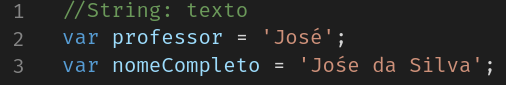
  - Number: números
  > EX: 
  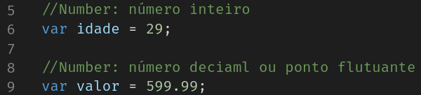
  - Boolean: verdadeiro ou falso
  > EX: 
  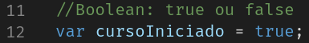
  - Object: objeto
  > EX: 
  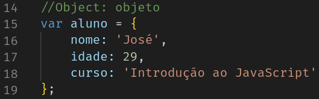
  - Array: lista
  > EX: 
  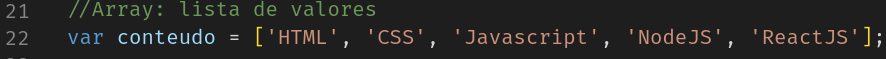
  - Function: função
  > EX: 
  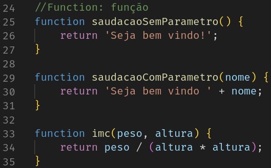
  - Undefined: indefinido
  > EX: 
  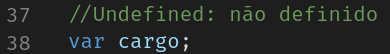
  - Null: nulo
  > EX: 
  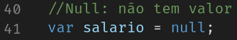

  ### Declaração de variáveis, var, let ou const?
  - var: variável global
  > EX: 
  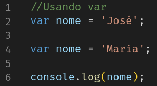
  - const: constante de escopo local
  > EX: 
  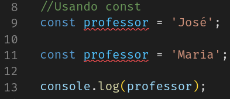
  - let: variável de escopo local
  > EX: 
  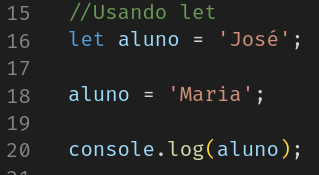

  
3. Assincronismo 

  
  - O que é assincronismo?
  - É a capacidade da execução de um código, esperar o processamento de uma requisição realizada para uma API ou função, antes de continuar sua execução.

  > EX:
  Sync:
  
  Resultado:
  

  -----------------------------------------
  Async:
  
  Resultado:
  
    

  
4. Fetch 

  
  - O que é o fetch?
  - O fetch provê ao navegador uma interface para a execução de requisições HTTP através de Promises.

  > EX:
  API via CEP pelo navegador:
  
  API via CEP pelo POSTMAN:
  
  -----------------------------------
  Utilizando o fetch para obter dados de uma API:
  
  Resultado:
  
   
  Resultado: 
  
  
    

  
5. Tratando erros 

  
  - O que é um erro?
  > É um evento que ocorre quando uma requisição é realizada e o servidor retorna um código de erro.

  > EX: 
  Coloquei um CEP errado e o servidor retornou um erro não tratado.
  
  ------------------------------
  Tratando o error:
  
  Resultado:
  

###### tags: `Frontend` `nodeJS` `JavaScript`