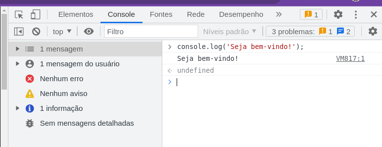
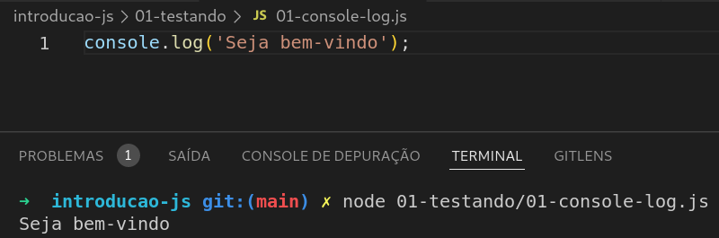

## Front-End | Introdução a Programação

<details>
  <summary>1. JavaScript + Ambiente</summary>
  
  ### O que é o JavaScript?
  - É uma linguagem de programação interpretada
  - Permite criar aplicativo mobile, desktop, web, etc.
  - É usado no front-end e no back-end ([Nodejs](https://nodejs.org/en/))

  ----------------------------------------------------
  ### ECMAScript + JavaScript
  - [ECMAScript](https://www.ecma-international.org) é uma versão da linguagem JavaScript
  - ECMAScript 2021 é a versão mais recente da linguagem
  - Desde 2015, é lançado uma versão todo ano  

----------------------------------------------------

  ### Temos 2 ambientes para executar o JS
  - Console do [Developer Tools](https://developer.mozilla.org/pt-BR/docs/Tools) `Atalho F12`
   
  
  ----------------------------------------------------
  - Terminal do Sistema Operacional com [Nodejs](https://nodejs.org/docs/latest-v17.x/api/console.html#console)
   
  
  
</details>


<details>

<summary>2. Variáveis var, const e let</summary>
  
  ### O que são variáveis?
  - Uma variável é um espaço na memória do computador para armazenar um valor.
  - Uma variável pode ser do tipo:
    - String
    - Number
    - Boolean
    - Object
    - Array
    - Function
    - Undefined
    - Null  
  
   > Podemos declaras variáveis usando `var`, `const` ou `let`.

----------------------------------------------------
  ### Declarando variáveis com `var`
  > Quando declaramos uma variável com palavra reservada `var`,  ela poderá ser acessada de qualquer lugar do código, pois ela é `elevada`[hoisting](https://developer.mozilla.org/pt-BR/docs/Glossary/Hoisting) para o topo do contexto do código de execução.
  
  ```js
  function welcome() {    
    console.log('Welcome ' + name); 
  }
  welcome();
  var name = 'Sara';
  ```

  > No exemplo acima, a variável `name` é elevada para o topo do contexto do código de execução, e logo após, a função `welcome` é executada.
  > Porém o valor da variável `name` é `undefined`, pois ela não foi definida. Somente após a função `welcome` ser executada, o valor da variável `name` é definido.

  ### Declarando variáveis com `const`
  > Quando declaramos uma variável com palavra reservada `const`, ela não poderá ser alterada, pois ela é `constante`.
    
  ```js
  const name = 'Sara';
  console.log(name);
  name = 'João';  // Erro!
  ```

  > No exemplo acima, a variável `name` é declara e atribuida o valor para ela, ao tentar alterar o valor inicial por outro, é lançado um erro, pois a variável `name` é `constante`.

  ### Declarando variáveis com `let`
  > Quando declaramos uma variável com palavra reservada `let`, ela poderá ser alterada, pois ela é `locavel`.
    
  ```js
  let name = 'Sara';
  console.log(name);
  name = 'João';  // Ok!
  ```

  > No exemplo acima, a variável `name` é declara e atribuida o valor para ela, ao tentar alterar o valor inicial por outro, o valor é alterado, pois a variável `name` é `locavel`.

  > OBS: Quando declaramos variáveis com `let` ou `const`, elas só podem ser acessadas, depois de serem declaradas, pois elas não sofrem hoisting que é o processo de elevar as variáveis para o topo do contexto do código de execução.

  EX: 
  ```js
  function welcome() {    
    console.log('Welcome ' + name); // Erro!
  }
  welcome();
  const name = 'Sara';
  ```

  > No exemplo acima, a variável `name` não é elevada para o topo do contexto do código de execução, pois ela só foi declarada depois da função, sendo que o correto é declara a variável `name` antes da função. 
</details>

<details>
  <summary>3. Exemplos de variáveis</summary>
  
  ### O que são variáveis?
  > As variáveis armazenam dados que podem ser definidos, atualizados e recuperados. Os valores atribuidos a uma variável têm um tipo. 

  ### Tipos básicos variáveis
  - String: texto
  > Variáveis de texto são declaradas com aspas duplas ou simples.

   
  ```js
  var nome = 'Sara';
  console.log(nome); // Sara
  ```
  ----------------------------------------------------
  - Number: números
  > Variáveis de números são declaradas com números inteiros/decimais e positivos/negativos. Decimais são declaradas com ponto.

   
  ```js
  var idade = 20;
  console.log(idade); // 20
  ```
  ----------------------------------------------------
  - Boolean: verdadeiro ou falso
  > Variáveis booleanas são declaradas com o valor `true` ou `false`.

   
  ```js
  var isTrue = true;
  console.log(isTrue); // true
  ```
  ----------------------------------------------------
  - Object: objeto
  > Variáveis de objeto são declaradas com chaves. Um objeto é uma coleção de pares chave/valor.

   
  ```js
  var obj = {
    nome: 'Sara',
    idade: 20
  };
  console.log(obj); // { nome: 'Sara', idade: 20 }
  ```
  ----------------------------------------------------
  - Array: lista
  > Variáveis de lista são declaradas com colchetes. Uma lista é uma coleção de valores.
   
  ```js
  var lista = [1, 2, 3, 4, 5];
  console.log(lista); // [ 1, 2, 3, 4, 5 ]
  ```
  ----------------------------------------------------
  - Function: função
  > Variáveis de função são declaradas com parênteses. Uma função é um bloco de código que executa uma tarefa específica.
   
  ```js
  function welcome() {
    console.log('Welcome Jonh');
  }
  welcome();
  ```
  ----------------------------------------------------
  - Undefined: indefinido
  > Variáveis indefinidas são declaradas sem nenhum valor.
   
  ```js
  var nome;
  console.log(nome); // undefined
  ```
  ----------------------------------------------------
  - Null: nulo
  > Variáveis nulas são declaradas com o valor `null`.

  ```js
  var nome = null;
  console.log(nome); // null
  ```
</details>

<details>
  <summary>3. Operadores </summary>
  
  - O que são operadores?
  > Os operadores são os símbolos que realizam operações matemáticas, lógicas e de comparação.

  - Operadores aritméticos
  
  ```js
  const x = 10;
  const y = 2;
  let resultado = 0;
  resultado = x + y; // 12
  resultado = x - y; // 8
  resultado = x * y; // 20
  resultado = x / y; // 5
  resultado = x % y; // 0
  ```
  ----------------------------------------------------
  - Operadores atribuição
    
  ```js
  let x = 10;
  x += 2; // 12
  x -= 2; // 10
  x *= 2; // 20
  x /= 2; // 10
  x %= 2; // 0
  ``` 
  ----------------------------------------------------
  - Operadores comparação
  
  ```js
  const x = 10;
  const y = 2;
  let resultado = false;
  resultado = x > y; // false
  resultado = x < y; // true
  resultado = x >= y; // false
  resultado = x <= y; // true
  resultado = x == y; // false
  resultado = x != y; // true
  ```
  ----------------------------------------------------
  - Operadores lógicos
   
  ```js
  const x = 10;
  const y = 2;
  let resultado = false;
  resultado = x > y && x > 5; // false
  resultado = x > y || x > 5; // true
  resultado = !(x > y); // false
  ```
</details>

<details>
  <summary>4. Condicional </summary>
  
  - O que são condicionais?
  > Condicionais são estruturas de decisão que permitem decidir se uma determinada ação deve ser executada ou não.

  - if/else
  
  ```js
  const x = 10;
  const y = 2;
  let resultado = 0;
  if (x > y) { // Se x for maior que y
    resultado = x;
  } else { // Senão
    resultado = y;
  }
  ```
  ----------------------------------------------------
  - if/else if/else
  
  ```js
  const x = 10;
  const y = 2;
  let resultado = 0;
  if (x > y) { // Se x for maior que y
    resultado = x;
  } else if (x < y) { // Senão, se x for menor que y
    resultado = y;
  } else { // Senão
    resultado = 0;
  }
  ```
  ----------------------------------------------------
  - ternário
  
  ```js
  const x = 10;
  const y = 2;
  let resultado = 0;
  resultado = x > y ? x : y; // Se x for maior que y, retorna x, senão retorna y
  ```
  ----------------------------------------------------
  - switch
  
  ```js
  const dia = 'segunda';
  switch (dia) {
    case 'segunda':
      console.log('Hoje é segunda-feira');
      break;
    case 'terça':
      console.log('Hoje é terça-feira');
      break;
    case 'quarta':
      console.log('Hoje é quarta-feira');
      break;
    case 'quinta':
      console.log('Hoje é quinta-feira');
      break;
    case 'sexta':
      console.log('Hoje é sexta-feira');
      break;
    case 'sábado':
      console.log('Hoje é sábado');
      break;
    case 'domingo':
      console.log('Hoje é domingo');
      break;
    default:
      console.log('Dia inválido');
      break;
  }
  ```    
</details>

<details>
  <summary>5. Loop </summary>
  
  - O que são loops?
  > Loops são estruturas de repetição que permitem executar determinada ação várias vezes.

  - for
  
  ```js
  for (let i = 0; i < 10; i++) { // O for percorre todos os elementos do array
    console.log(i);
  }
  ```

  - while
  
  ```js
  let i = 0;
  while (i < 10) { // O while percorre todos os elementos do array
    console.log(i);
    i++;
  }
  ```

  - do while
  
  ```js
  let i = 0;
  do { // O do while percorre todos os elementos do array
    console.log(i);
    i++;
  } while (i < 10);
  ```

  > OBS: Existe outros loops for of e forEach que podem ser usados para percorrer arrays.  

</details>

<details>
  <summary>6. Acessando/Adicioando/Removendo elementos do Array </summary>

  - Acessando elementos de um array
  
  ```js
  const lista = [1, 2, 3, 4, 5];
  console.log(lista[0]); // 1
  console.log(lista[1]); // 2
  ```

  - Pecorrendo elementos de um array com for
  
  ```js
  const lista = [1, 2, 3, 4, 5];
  for (let i = 0; i < lista.length; i++) { // O for percorre todos os elementos do array
    console.log(lista[i]);
  }
  ```

  - Pecorrendo elementos de um array com for...of
  
  ```js
  const lista = [1, 2, 3, 4, 5];
  for (let item of lista) { // item é uma variável temporária
    console.log(item);
  }
  ```
 - Pecorrendo elementos de um array com forEach
  
  ```js
  const lista = [1, 2, 3, 4, 5];
  lista.forEach(function(item) { // item é uma variável temporária
    console.log(item);
  });
  ```
  ----------------------------------------------------
  - Adicionando elemento no final de um array
  
  ```js
  const lista = [1, 2, 3, 4, 5];
  lista.push(6); // Adiciona o elemento 6 no final do array
  console.log(lista); // [1, 2, 3, 4, 5, 6]
  ```
  ----------------------------------------------------
  - Removendo elemento do final de um array
  
  ```js
  const lista = [1, 2, 3, 4, 5];
  lista.pop(); // Remove o último elemento do array
  console.log(lista); // [1, 2, 3, 4]
  ```
  ----------------------------------------------------
  - Removendo elemento do ínicio de um array
  
  ```js
  const lista = [1, 2, 3, 4, 5];
  lista.shift(); // Remove o primeiro elemento do array
  console.log(lista); // [2, 3, 4, 5]
  ```
  ----------------------------------------------------
  - Adicionando elemento no ínicio de um array
  
  ```js
  const lista = [1, 2, 3, 4, 5];
  lista.unshift(0); // Adiciona o elemento 0 no início do array
  console.log(lista); // [0, 1, 2, 3, 4, 5]
  ```
  ----------------------------------------------------
  - Remoção de uma quantidade `X` de elementos iniciando de uma posição do array
  
  ```js
  const lista = [1, 2, 3, 4, 5];
  lista.splice(2, 3); // Remove 3 elementos iniciando da posição 2
  console.log(lista); // [1, 2]
  ```
</details>


<details>
  <summary>7. Métodos de array </summary>

  - Método `.map`
  
  ```js
  const lista = [1, 2, 3, 4, 5];
  const listaDois = lista.map( (item) =>  { // item é uma variável temporária
    return item * 2;
  });
  console.log(listaDois); // [2, 4, 6, 8, 10]
  ```
  > OBS: No exemplo acima, a condinção é pega cada item é multiplicar por 2, retornando um novo array.
  ----------------------------------------------------
  - Método `.filter`
  ```js
  const lista = [1, 2, 3, 4, 5];
  const listaDois = lista.filter( (item) => { // item é uma variável temporária
    return item % 2 === 0;
  });
  console.log(listaDois); // [2, 4, 6]
  ```
  > OBS: No exemplo acima está filtrando os elementos pares, está pegando cada elemento e verificando se o resto é igual a 0, se for, retorna um novo array com elementos pares.
  ----------------------------------------------------
  - Método `.reduce`
  
  ```js
  const lista = [1, 2, 3, 4, 5];
  const soma = lista.reduce( (total, item) => { // total é inicializado como 0 e item é uma variável temporária
    return total + item;
  });
  console.log(soma); // 15
  ```
  > OBS: No exemplo acima, o `reduce` recebe dois parâmentros, o total é a variável que irá receber o valor do total e o item é a variável que irá receber cada item do array. O novo array é somando cada item com o total, retornando a soma total.
  ----------------------------------------------------
  - Método `.find`
  
  ```js
  const lista = [1, 2, 3, 4, 5];
  const item = lista.find( (item) => { // item é uma variável temporária
    return item === 3;
  });
  console.log(item); // 3
  ```
  > OBS: No exemplo acima, o `find` está verificando se o item é igual a 3, se for, retorna o item.
  ----------------------------------------------------

  - Método `.some`
  
  ```js
  const lista = [1, 2, 3, 4, 5];
  const temPar = lista.some( (item) => { // item é uma variável temporária
    return item % 2 === 0;
  });
  console.log(temPar); // true
  ```
  > OBS: No exemplo acima, o `some` está verificando se algum item é par, se for, retorna true.
  ----------------------------------------------------
  - Método `.every`
  
  ```js
  const lista = [1, 2, 3, 4, 5];
  const temPar = lista.every( (item) => { // item é uma variável temporária
    return item % 2 === 0;
  });
  console.log(temPar); // false
  ```
  > OBS: No exemplo acima, o `every` está verificando se todos os items são pares, se for, retorna true.
  ----------------------------------------------------
  - Método `.sort`
  
  ```js
  const lista = [5, 3, 1, 4, 2];
  const listaOrdenada = lista.sort( (a, b) => { // a e b são variáveis temporárias
    return a - b;
  });
  console.log(listaOrdenada); // [1, 2, 3, 4, 5]
  ```
  > OBS: No exemplo acima, o `sort` está ordenando os elementos do array, retornando um novo array ordenado.
  ----------------------------------------------------
  - Método `.reverse`
  
  ```js
  const lista = [1, 2, 3, 4, 5];
  const listaInvertida = lista.reverse();
  console.log(listaInvertida); // [5, 4, 3, 2, 1]
  ```
  > OBS: No exemplo acima, o `reverse` está inverte os elementos do array, retornando um novo array invertido.
  ----------------------------------------------------
  - Método `.join`
  
  ```js
  const lista = [1, 2, 3, 4, 5];
  const listaString = lista.join(' - ');
  console.log(listaString); // 1 - 2 - 3 - 4 - 5
  ```
  > OBS: No exemplo acima, o `join` está juntando os elementos do array, retornando uma string.
  ----------------------------------------------------
  - Método `.toString`
  
  ```js
  const lista = [1, 2, 3, 4, 5];
  const listaString = lista.toString();
  console.log(listaString); // 1,2,3,4,5
  ```
  > OBS: No exemplo acima, o `toString` está transformando o array em string, retornando uma string.
  ----------------------------------------------------
  - Método `.concat`
  
  ```js
  const lista = [1, 2, 3, 4, 5];
  const listaDois = [6, 7, 8, 9, 10];
  const listaConcatenada = lista.concat(listaDois);
  console.log(listaConcatenada); // [1, 2, 3, 4, 5, 6, 7, 8, 9, 10]
  ```
  > OBS: No exemplo acima, o `concat` está concatenando dois arrays, retornando um novo array.
  ----------------------------------------------------
  - Método `.slice`
  
  ```js
  const lista = [1, 2, 3, 4, 5];
  const listaDois = lista.slice(2, 4);
  console.log(listaDois); // [3, 4]
  ```
  > OBS: No exemplo acima, o `slice` está pegando dois parâmetros, o primeiro é o índice inicial e o segundo é o índice final, retornando um novo array.
  ----------------------------------------------------
  - Método `.splice`
  
  ```js
  const lista = [1, 2, 3, 4, 5];
  const listaDois = lista.splice(2, 2);
  console.log(listaDois); // [3, 4]
  ```
  > OBS: No exemplo acima, o `splice` está pegando dois parâmetros, o primeiro é o índice inicial e o segundo é o número de elementos a serem removidos, retornando um novo array.

</details>


###### tags: `Frontend` `nodeJS` `JavaScript` `variaveis` `condicional` `operadores` `loop`